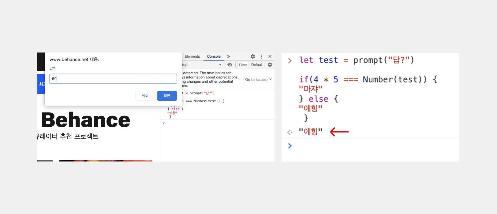
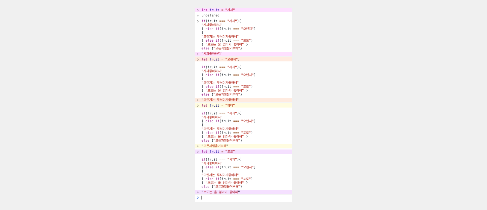
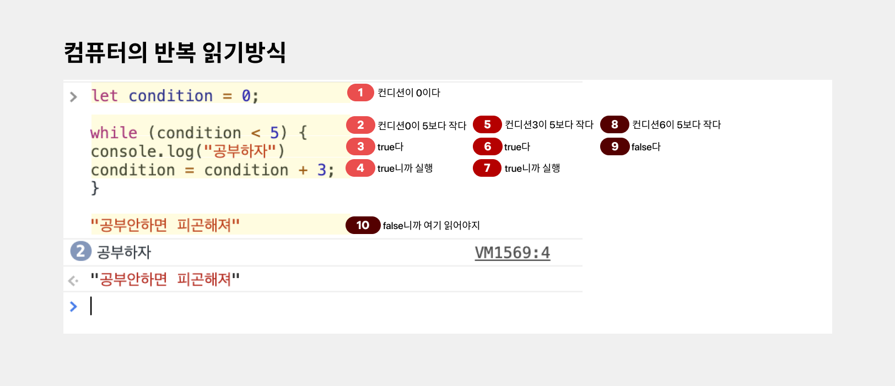
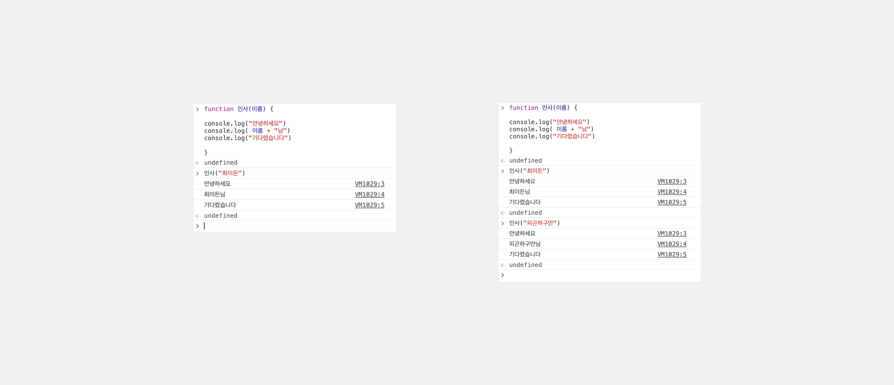

# **자바스크립트, 따라가보자**

> <span style ="color:#2F80ED" > **참고자료A** :</span> **[코드잇 자바스크립트 강의](https://www.codeit.kr/courses/intro-to-programming-in-javascript/topics/getting-started-with-javascript)** 강의의 초반을 참고합니다.

---

### 알고있던 것 👉 **데이터형**</spna>

### 몰랐던 것 👉 <span style ="color:#FF5C29" > **자료형**</spna>

- 추상화 , **복잡한 것들을 목적에 맞게 단순화하는 것**
- 변수, 함수, 객체등에 모두 이 추상화의 개념이 숨어져있다.

---

### 작명가이드

1. 의미없는 이름은 좋지 않다.

2. 추상적인 이름은 좋지 않다.

3. camelCase로 작성하는 것이 좋다.

- 좋은 코드 스타일을 위해 다양한 약속들을 만들 수 있다. 이런 약속들을 <span style ="color:#2F80ED" > **스타일가이드** </spna> 혹은
  <span style ="color:#2F80ED" > **코딩 컨벤션** </spna> 이라고 부른다.

> <span style ="color:#2F80ED" > **참고자료** :</span> [Airbnb JavaScript 스타일가이드 👉 ](https://github.com/ParkSB/javascript-style-guide)

> <span style ="color:#2F80ED" > **참고자료** :</span> [Google JavaScript 스타일가이드 👉 ](https://google.github.io/styleguide/jsguide.html)

---

## **유튜브 강의**

> <span style ="color:#2F80ED" > **참고자료B** :</span> **[유튜브 자바스크립트 강의](https://www.youtube.com/watch?v=E0WK0Wxil8I&list=PLcqDmjxt30Rtbxbh4eJREOVekql_kWVmu&index=7)**

- 해당강의는 크롬 개발자도구로만 진행

### 알고있던 것 👉 **데이터형**</spna>

- 숫자, 문자, 불린(참,거짓)
- 연산자

### 비교연산자

- 같은지 알아보는 연산자

```

5 == '5' // true
5 === '5' // false

```

- 다른걸 알아보는 연산자

```

5 !== '5'

```

- 연산자는 우선순위가 있고, = 이 가장 마지막에 실행된다.
- '문자'와 '문자'를 더할 수 있다.
- '문자'와 숫자를 더할 수 있다.
- 제곱연산자 \*\* 도 존재함. 알아두자.

### 조건문

- if 와 else
- switch라는 것도 있는데 찾아보세요.

```

let test = prompt("답?")

if(4 * 5 === Number(test)) {
"마쟈"
} else {
"에힝"
 }

```



- else if , 조건을 계속 만들 수 있다.

```

let fruit = '사과';

if (fruit === '사과' ){
  '사과는 좋아하지^^'
} else if( fruit === '오렌지 ') {
  '오렌지는 두식이가 좋아하지.'
} else if(fruit === '수박') {
  '수박도 나름 좋아하지'
} else (fruit === '레몬') {
  '레몬은 힘들지 '
}


```



- if는 필수고, else와 else if는 생략해도 된다.

### 반복문

- while

```

while (조건) {
  console.log('안녕하세요')
}

let 값 = 0
while(값 < 10) {
    console.log(값)
    값 = 값 + 1
}

// 안녕하세요가 10번이 실행된다.

```



- **for**

```
for(처음; 조건; 끝) { 실행 }

```


### 함수

- 반복적인 코드작성을 funtion으로 처리해줘서 반복을 최소화해줄 수 있다.

```

console.log('안녕하세요')
console.log('NNN님') // 불필요하게 계속 다시 코드를 쳐야하는 부분
console.log('안녕하세요')

을

function 인사(이름) {
console.log('안녕하세요')
console.log( 이름 + '님') // 다시 처리
console.log('안녕하세요')


}

```



### 문자열 심화

```

'함수' // 라는 문자에서 첫 번째 글자를 가져오고싶다.
'함수'[0] // 으로 하면 첫 번째 글자를 가져올 수 있다.

```

- 컴퓨터는 대부분 숫자를 0에서부터 시작한다.

```

.length
"아주많은글자를쓰고".length // 를 붙이면 글자수를 알려준다.

```
