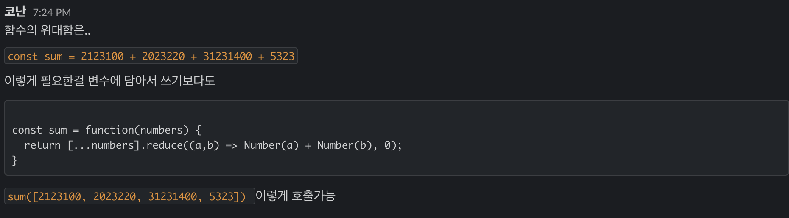

# 6회차 :

> <span style ="color:#2F80ED" > **함께한 곳** :</span> **[repl](https://repl.it/@woody287/JSBasic#main.js)** 강의의 초반을 참고합니다.

---

## 예습을 해왔습니다

👇 예습코드 👇

```
let costume = "코난이 입은 코스튬";
let winnerCell = "디자인챕터";
let answer = prompt(costume);
if( answer === "백설공주"  ) {
    alert( "포상은 프로모션셀이다!" )
} else if ( wineerCell !== "디자인챕터" ) {
    alert( "우리가 속았다!" )
} else {
    "보상은 디자인챕터다!"
}
```

👇 코난 교정 코드 👇

```
const konan = prompt('할로윈에 무엇을 입을꺼니?');
if (konan === '백설공주') {
  console.log('프로모션 셀이 우승이다.')
  const winningCell = prompt('어디가 우승할까요?');
}  else if (winningCell === '디챕') {
  console.log('디챕이 우승이야!')
} else {
  console.log('우린 속은거다.')
}

```

### 조건문

`if`: 만약에 ~하면

`else if`: ~한게 아니고 ~이라면

`else`: 외의 모든 경우

### 함수가 왜 있어야 할까?

```
function doQuestion(costumeQuestion, costumeAnswer, winningCellQuestion, winnerCellAnswer) {
  let konan = prompt(costumeQuestion);

  if (konan == costumeAnswer){
    alert("할로윈보상은 프로모션 셀이 가져간다!");
  } else {
    let winnerCell = prompt(winningCellQuestion);
    if (winnerCell == winnerCellAnswer){
      alert(`할로윈 보상은 ${}이야!`);
    } else {
      alert("야 속았다");
    }
  }
}

```

```
doQuestion('할로윈에 뭐 입을꺼야?', '백설공주', '어느셀이 우승할거 같아?', '디챕')

// 이제 여기 질문은 매번 바뀌어도 괜찮다.
```

- 매번 하드코딩을 하지않기 위해서.
  

# 숙제

| 이름   | 수학 | 영어 | 사회 | 과학 | 국어 |
| ------ | ---- | ---- | ---- | ---- | ---- |
| 코난   | 92   | 92   | 78   | 72   | 88   |
| 캐스퍼 | 87   | 75   | 100  | 72   | 98   |
| 이든   | 100  | 98   | 99   | 22   | 0    |
| 햄씨   | 100  | 100  | 87   | 56   | 33   |
| 이데   | 100  | 98   | 22   | 0    | 62   |
| 반     | 92   | 74   | 32   | 100  | 100  |

<br>
## 문제 1번

> 각 학생의 평균을 구해서, 평균 점수가 제일 높은 사람을 구하시오

## 문제 2번

> 과목별 평균점수를 구하고, 제일 점수대가 높은 과목과 낮은 과목을 구하시오.

## 문제 3번

> 각 학생의 평균을 구한후, 성적의 백분율을 구하시오.

---

기한은 다음주 월요일까지 ㅎㅎ
활용할 것들 `function`, `조건문`, `연산`

`힌트 : key, 밸류 , 배열, 객체, 배열`
