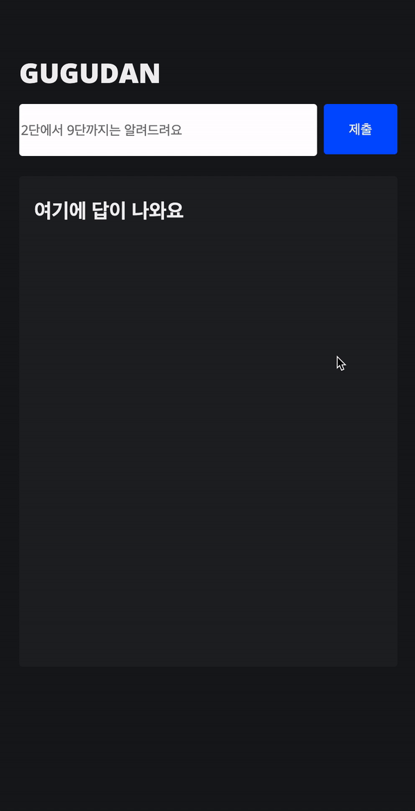
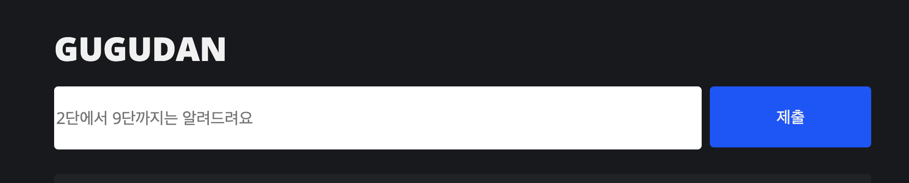

# 스스로 학습하기 제 2탄

### 구구단 더 아름답게 해보기

> **진행한 것** :
> <br> **01.** html을 나름 시멘틱하게 정리해보려고 노력했다. 잘 하지 못한 것 같지만, 그래도 처음에 작성한 코드보다는 깔끔해 보인다.
> <br> **02** SCSS를 사용해서 컬러와 폰트 set을 편안하게 사용해봤다.
> <br> **03** 브라우저 창을 줄여도 어느정도는 배치가 커버되게 만들었다. 퍼센트를 어떻게 사용하면 되는지 감을 좀 잡은 느낌이다.

---

## 그러나 잘 되지 않은 것들



1.  html에 구구단 값이 아주 잠깐 노출되었다가 리셋이된다.

- `.getElementById` 와 `querySelector`무한 교체해보았지만 안됐다🥺

```

let getGugudan = document.getElementById("input__gugudan");
let getGugudanBtn = document.getElementById("gugudan-btn");


getGugudanBtn.onclick = function() {
  getGugudan = parseInt(getGugudan.value)

 if ( isNaN(getGugudan) ) {
    document.querySelector(".contnets__answer").textContent = "숫자로만써주세욥!"
 } else if ( getGugudan < 2 || getGugudan > 10 ) {
    document.querySelector(".contnets__answer").textContent = "2단과 10단 사이에서만 작성해주세욥!"
  } else {
    for (let i = 1; i <= 9; i++ ){
      document.querySelector(".contnets__answer").textContent = getGugudan + "x" + i + "=" + getGugudan * i + '<br>';
    };
  }
}
```



2.  인풋과 버튼의 높이 값이 일치하지 않는다. 왜일까...?!

- `height: 60px`로 동일하게 높이를 줬는데도 이런 현상이 발생한다.

```
h1 {
  font-size: $title-font;
  font-weight: $title-weight;
  margin-bottom: 16px;
  color: $vanWhite;
}

form {
  width: 100%;
  display: flex;
  justify-content: center;
  margin-bottom: 24px;
}

input[type="text"] {
  font-size: $input-font;
  width: 80%;
  height: 60px;
  border-radius: 4px;
}

input[type="submit"] {
  width: 20%;
  height: 60px;
  border-radius: 4px;
  background-color: $vanBlue;
  margin-left: 8px;
  color: $vanWhite;
}

```

---

### 구구단 더 아름답게 해보기

> **발전한 것** :
> <br> html/css 보다 상대적으로 낯설지만 처음 코난에게 설명을 들었을 때 보다는 자바스크립트가 친숙해지지 않았나... 싶다. 콘솔창을 키고 뭐라도 하나 쳐보려고 하는 태도가 생긴 걸 발전으로 생각하고 위안을 삼아본다.
> <br> 같은 예제를 계속 디자인을 바꿔보면서 적용해보는 것도 괜찮은 공부 방법이라 생각이 들었다.

> **여전히 부족한 것** :
> <br> 검색을해도 어떤식으로 적용시켜야 할지 모르는 것, 시간을 쪼개서 공부할 시간을 만들지 못하는 것... 조급함에 계속 우왕좌왕하는 것 같다.
> <br> 부끄럽게도 다시 검색해 볼 리스트들을 검색해 보지 않았다. 스스로에게 더 엄격해질 필요가 있다.

### 다시 검색해 볼 것 (내가 스스로 찾아볼 때까지 붙여놓을 예정)

- `reduce`
- `이니셜`
- `Array.reduce `
- `for`: 명령형 프로그래밍
- `map` `filter` : 선언형 프로그래밍
- `템플릿 리터럴`
- `forEach` : 배열순회
- `sort`
- `강제줄바꿈`
- `toFixed()`
- `2차원 배열` 📌
