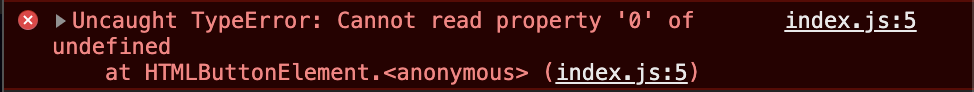

# 복습합니다.

- html까지는 레이아웃을 바꾸어도 어느정도 표현할 수 있는 듯 하다.
- 하지만 여전히 디테일은 떨어진다.
- 오른쪽 컨텐츠 배경화면에 오퍼시트를 먹이고 싶었는데, 잘 안됐다.

  - [시도해 본 방법 LINK](https://codingbroker.tistory.com/58)
  - 가상 요소(::after) 사용하는 방법이라는데 이 마저도 잘 안됐다.
  - 안 됐던 이유를 모르겠다.

### 자바스크립트 이해도가 너무 떨어진다.



- 코난의 자바스크립트를 복붙해도 안된다.
- 이유는 모르겠다...

시간이 되면 자바스크립트만 엄청 파야할 것 같다.

### 그래서!

- 자바스크립트에 대해서 _만_ 한 번 총체적으로 되돌아보는 시간을 가지고라 함.

### + 201007 학습추가

```
document.querySelector(".cooltto__numberBtn").addEventListener("click", () => {
  const luckyNumbers = lottery();
  document.querySelector(
    ".cooltto__num.numA"
  ).textContent = luckyNumbers[0].toString();
  document.querySelector(
    ".cooltto__num.numB"
  ).textContent = luckyNumbers[1].toString();
  document.querySelector(
    ".cooltto__num.numC"
  ).textContent = luckyNumbers[2].toString();
  document.querySelector(
    ".cooltto__num.numD"
  ).textContent = luckyNumbers[3].toString();
  document.querySelector(
    ".cooltto__num.numE"
  ).textContent = luckyNumbers[4].toString();
  document.querySelector(
    ".cooltto__num.numF"
  ).textContent = luckyNumbers[5].toString();
});

//=============================================
//👇코난의 어드바이스👇
//=============================================

function lottery() {
  const winningNumberArr = [];
  let lotteryArr = getLotteryNumberSet();
  let count = 0;
  while (count !== 6) {
    const lotteryNumber = lotteryArr[getLotteryNumberIndex(lotteryArr)];
    winningNumberArr.push(lotteryNumber);
    lotteryArr = lotteryArr.filter((item) => item !== lotteryNumber);
    count++;
  }
  return winningNumberArr.sort((a, b) => Number(a) - Number(b));
}
```

- 코난의 어드바이스에 따라 코드를 추가했더니 잘 반영이 됐다!
- 사각 영역 하나에만 번호가 랜덤으로 걸려 클래스에 .numA 를 추가했다.

```document.querySelector(
    ".cooltto__num.numA"
  ).textContent = luckyNumbers[0].toString();11
```
