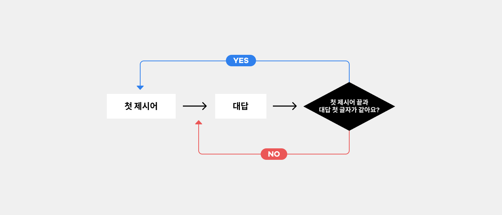
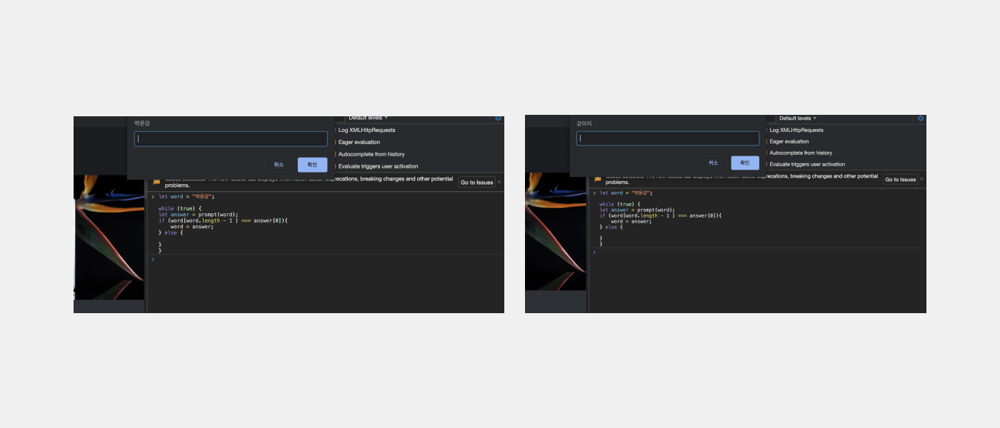
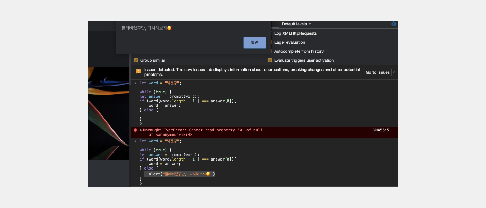

# 끝말잇기

> <span style ="color:#2F80ED" > **참고자료B** :</span> **[유튜브 자바스크립트 강의](https://www.youtube.com/watch?v=E0WK0Wxil8I&list=PLcqDmjxt30Rtbxbh4eJREOVekql_kWVmu&index=7)**

- 순서도를 그리는 걸 시작해보세요.


위 순서도를 코드로 옮겨보자.

```

let word = "박운강" // 첫 제시어
let answer = prompt(word) // 대답

```

- 첫 제시어와 대답 변수를 만들어준다.
- 대답은 받아야하기 때문에 prompt로 작성.

```

if(word[2] === answer[0])

```

- 복습때 배웠던 문자열로 조건을 만들어주자.
- **하지만 위 코드로는 첫 제시어에 따라 마지막 문자열 값이 매번 바뀌는 상황을 대처할 수 없다.**

```

if(word[word.length - 1] === answer[0])

```

- **때문에 문자의 갯수를 읽어주는 .length에 -1을 해준다.**
- 컴퓨터는 0에서부터 수를 세기때문에 .length - 1을 해주면 끝 글자를 읽어준다.
- "첫 제시어 끝과 대답 첫글자가 같은가?" 라는 조건을 만들었다.

```

let word = "박운강"
let answer = prompt(word)

if(word[word.length - 1] === answer[0]){
 //첫 제시어 끝과 대답 첫글자가 같은면?

  word = answer; // word는 answer를 저장. (품어라)

} else {

}

```

- **조건에 맞는 값을 지정해준다.**
- 끝말잇기는 계속 대답이 반복 되어야하기 때문에, while로 한 번 감싸준다.

```

let word = "박운강"

while(trul) { //👈 반복되어야하는 것을 감싸주기


let answer = prompt(word) // 👈 대답 prompt까지 포함!!!

if(word[word.length - 1] === answer[0]){
 //첫 제시어 끝과 대답 첫글자가 같은면?

  word = answer;

} else {

}
} // 👈


```


잘 실행되는 모습

- 하지만 틀렸을 때 무작정 반복되는 것 보다, 틀렸다고 알려주는 게 더 친절하다.
- 틀림 알림창을 추가해보자.

```

let word = "박운강"

while(trul) {


let answer = prompt(word)

if(word[word.length - 1] === answer[0]){
 //첫 제시어 끝과 대답 첫글자가 같은면?

  word = answer;

} else {
  alert("틀려버렸구만, 다시해보자🥰") //👈 친절한 알림 추가
}
}

```



귀여운 알림창까지 완료🎉🎉🎉🎉🎉

---

## 만약 **for**로 바꾼다면?

```

for (let word = "박운강"; true;) {

    let answer = prompt(word);

    if(word[word.length - 1]===answer[0]){
    word = answer;
    }else { alert("틀려버렸구만, 다시해보자🥰")  }

}

```

- for와 while을 오갈 수 있도록 연습하는게 좋다.
