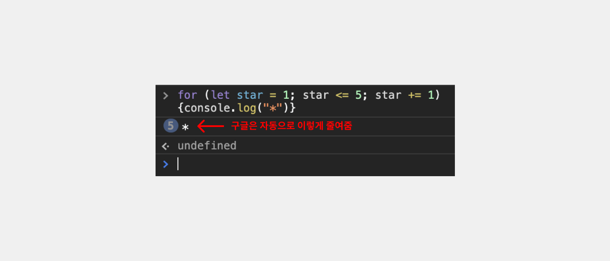
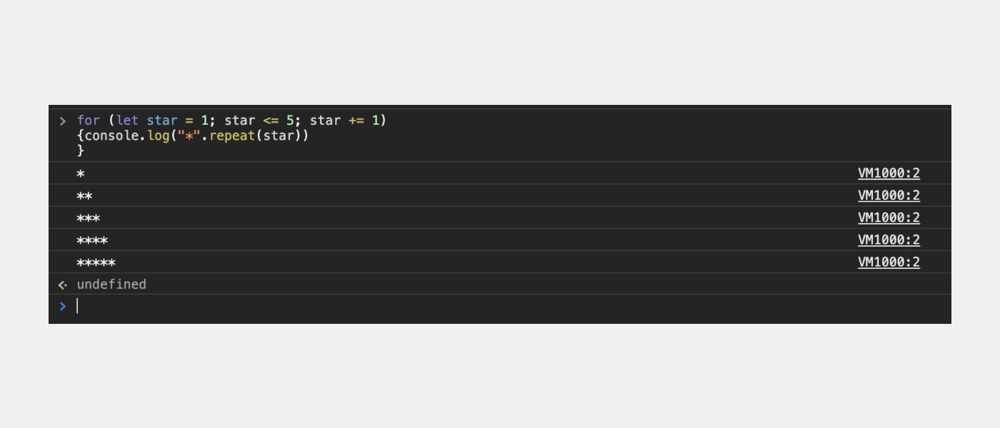
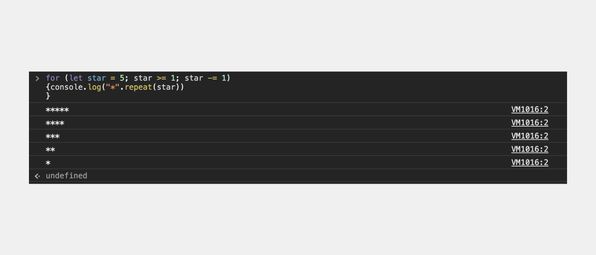
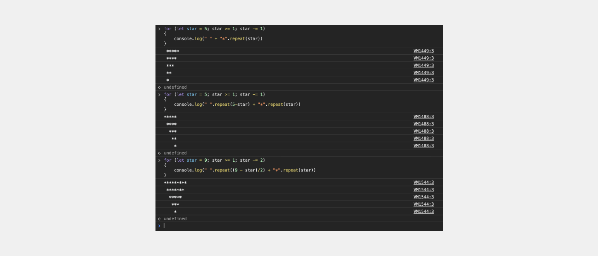
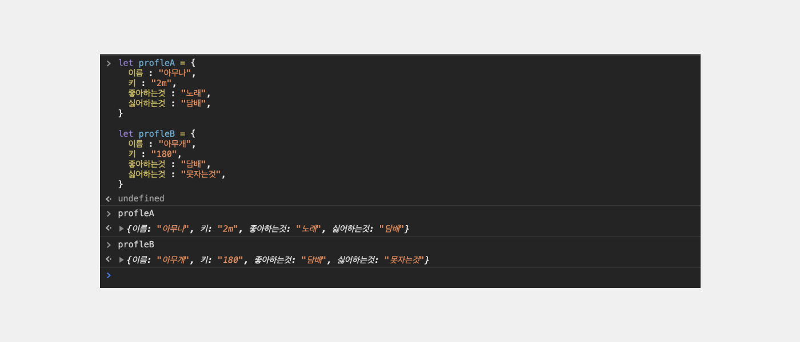
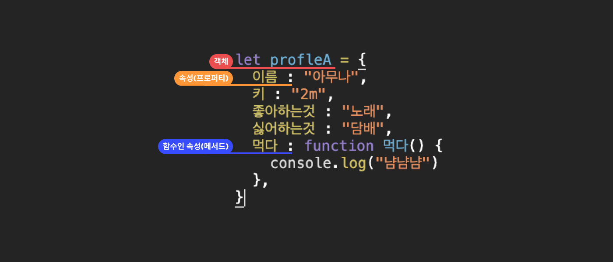

# 구구단과 별찍기

> <span style ="color:#2F80ED" > **참고자료B** :</span> **[유튜브 자바스크립트 강의](https://www.youtube.com/watch?v=E0WK0Wxil8I&list=PLcqDmjxt30Rtbxbh4eJREOVekql_kWVmu&index=7)**

- for문으로 반복문을 연습을 해보자.
  
  `for ( 처음(1); 조건(2); 끝(4)){ 실행(3) }` 순으로 출력되는 걸 유의하자.

---

```

for (let star = 1; star <= 5; star += 1){
  console.log("*")
  }

```

- `<=` 작거나 같다.
- `+=` : **star** = **star** + 1 와 같은 의미지만 중복되는 걸 줄여쓸 수 있다.


위와같이 출력이 된다.

- 구글은 자동으로 줄여주는 기능을 가지고있다.

```

for (let star = 1; star <= 5; star += 1){
  console.log("*".repeat(star))
  }

```

- `.repeat(star)` 를 붙여줘서 반복되는 동안 star의 갯수가 늘어나도록 해줄 수 있다.


위와같이 출력이 된다.


조건만 잘 이해하고 붙이면 반대도 가능하다.

### 등차수열 , 등비수열 , 개차수열 표현



아래와 같은 모양을 표현하려면 어떻게 해야할까?

```
      *
     ***
    *****
     ***
      *
```

- 이를 출력하기 위해서 **객체**라는 것을 집고 넘어가는 것이 좋다.

---

## **객체** 와 **배열**

- 객체

  - 함수`function(){}`
  - 배열

- 숫자
- 문자
- 불린
- null
- undefinde

객체 안에 함수와 배열이 있다.

## 객체가 왜 중요할까?

- 두 사람의 프로필이 필요할 때를 보자.

```
// porilfe A
let 이름A = "아무나"
let 키A = "2m"
let 좋아하는것A = "노래"
let 싫어하는것A = "담배"

// porilfe B
let 이름B = "아무개"
let 키B = "180"
let 좋아하는것B = "담배"
let 싫어하는것B = "못자는것"

```

- 이를 묶어서 정리할 수 있다.

```

let profleA = {
  이름 : "아무나",
  키 : "2m",
  좋아하는것 : "노래",
  싫어하는것 : "담배",
}

let profleB = {
  이름 : "아무개",
  키 : "180",
  좋아하는것 : "담배",
  싫어하는것 : "못자는것",
}

```



```
let profleA = {
  이름 : "아무나",
  키 : "2m",
  좋아하는것 : "노래",
  싫어하는것 : "담배",
  // 👇 함수를 넣을 수 있다, 함수가 들어있는 프로퍼티를 메서드라 한다.
  먹다 : function 먹다() {
    console.log("냐냠")
  },
}
```



### 호출법

```

profleA["좋아하는것"]
"노래"

혹은

profile.먹다
profile.먹다()

```

---

> ## 기력이 떨어져 오늘은 여기까지.
